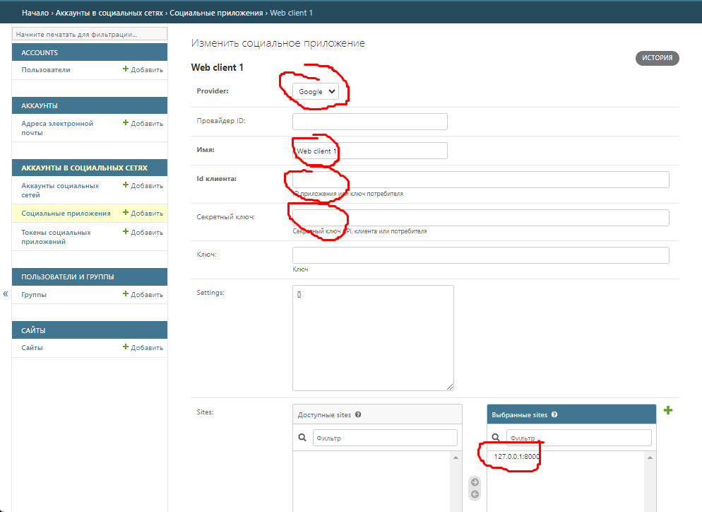

# Разработка и интеграция приложения с использованием Docker и Docker Compose

## Описание

Проект представляем собой простой API, который позволит суперпользователям и
администраторам регистрировать, просматривать и редактировать пользователей
и группы в системе и предоставлять пользователям различные уровни доступа через группы.
Проект включает функции регистрации и авторизации пользователей
через социальные сети (Google).

## Стек

+ Django REST framework
+ PostgreSQL
+ Docker

## Функционал

+ CRUD-операции с профилями пользователя.
+ CRUD-операции с группами.
+ Все операции доступны только Суперпользователям и Администраторам.
+ Аутентификация пользователя доступна через базовую аутентификацию Django.
+ Доступна регистрация и авторизация пользователя через профиль Google.

## Особенности

+ Между пользователями и группами добавлены гиперссылочные отношения.

## Маршруты

- `GET /users/` - Список пользователей
- `POST /users/` - Создание пользователя
- `PUT /users/id/` - Изменение данных пользователя
- `DELETE /users/id/` - Удаление пользователя

- `GET /groups/` - Список пользователей
- `POST /groups/` - Создание пользователя
- `PUT /groups/id/` - Изменение данных пользователя
- `DELETE /groups/id/` - Удаление пользователя

- `GET /api-auth/login/` - Базовую аутентификацию Django REST framework
- `GET /accounts/login/` - Регистрация и авторизация с возможностью использовать профиль Google

## Запуск проекта с использованием Docker-compose

Клонируйте репозиторий

    git clone https://github.com/...

В фале .env укажите свои данные суперпользователя

    # .env
    DJANGO_SUPERUSER_USERNAME=superuser
    DJANGO_SUPERUSER_EMAIL=mail@mail.ru
    DJANGO_SUPERUSER_PASSWORD=password

Запустите контейнеры через `docker-compose`

    docker compose up -d

В процессе запуска будет создан суперпользователь

Остановить проект

    docker compose down

### Настройка API Google

На сайт: https://console.developers.google.com, создайте
или используйте сущестующий проект

Сохраните коды `Client ID` и `Client secret`

Перейдите на сайт администратора

    http://127.0.0.1:8000/admin/

В разделе Сайты добавьте сайт:

В разделе "Социальные приложения"
добавьте приложение и заполните данные:

+ Провайдер: Google;
+ Имя: Name;
+ Идентификатор клиента: `Client ID`;
+ Секретный ключ: `Client secret`;
+ Сайты: 127.0.0.1:8000.

    http://127.0.0.1:8000/accounts/login/

